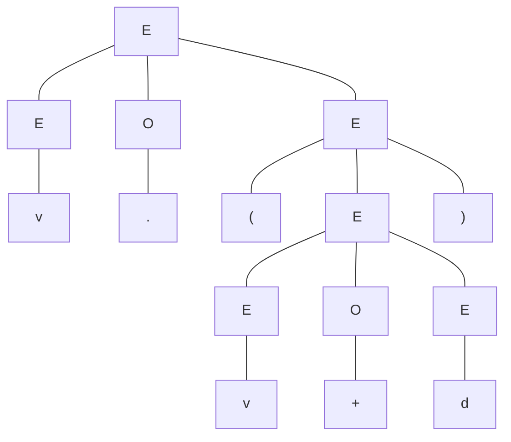

## Definition of Context-Free Grammars

### Four components of  grammars:

1. **The set of terminals**: An finite set of symbols which serves as alphabet.
2. **The set of variables (or nonterminals, syntactic categories):** Each variable represents a set of strings, usually in uppercase.
3. **Start symbol**: A special variable,  which represents the language being defined.
4. **The set of productions (or rules)**: A finite set of rules that represent the recursive definition of a language. Each production looks like $head \rightarrow body$. 

<!-- more -->

### Formal definition of context-free grammar:

> A ***context-free grammar*** (***CFG***) is a 4-tuple $G=(V,T,P,S)$, which satisfies:
>
> $$V\cap T=\emptyset,S\in V, $$
>
> $$P\subseteq\{A\rightarrow \alpha|A\in V,\alpha \in (V\cup T)^*\}$$

The first two rules describe set of terminals, set of variables and start symbol. The last one requires all productions in $P$ to be in a specific form. Here are two examples of CFG:

1. CFG $G_{01}=({S},{0,1},P,S)$, where elements of $P$ are:
   - $S\rightarrow 01$
   - $S\rightarrow 0S1$
2. CFG $G_{exp}=(\{E,O\},\{(,),+,\cdot,v,d\},P,E)$, and $P$ contains exactly:
   - $E\rightarrow EOE$
   - $E\rightarrow (E)$
   - $E\rightarrow v$
   - $E\rightarrow d$
   - $O\rightarrow +$
   - $O\rightarrow \cdot$

**A compact notion for productions:**

Writing $A\rightarrow \alpha_1|\alpha_2|\cdots|\alpha_n$ in place of $A\rightarrow \alpha_1$, $A\rightarrow\alpha_2$, $\ldots$ , $A\rightarrow\alpha_n$ for convenience.

## Derivation Using a Grammar

### Recursive inference and derivation:

There are two approaches to infer if certain strings are in the language of a certain **variable**.

#### 1.Recursive inference:

Reducing the given string to a variable by applying productions from body to head.

- For CFG $G_{exp}$ (defined above), and string $v\cdot(v+d)$:

  $v\cdot(v+d)\implies v\cdot(v+E)\implies vO(v+E)\implies\cdots\implies EO(EOE)\implies EO(E)\implies EOE\implies E$

#### 2.Derivation:

Expanding variable into the string by applying productions from head to body.

- For CFG $G_{exp}$ (defined above), and string $v\cdot(v+d)$:

  $E\implies EOE\implies EO(E)\implies EO(EOE)\implies vO(EOE)\cdots\implies v\cdot(v+d)$

*PS: Actually we need to prove that the two approaches are equivalent.*

### Derivation relation:

We define a relation $\underset{G}{\Rightarrow}$ on $(V\cup T)^*$ to denote **derivation**. If $\alpha,\beta\in(V\cup T)^*$ and $A\rightarrow \gamma\in P$, then $\alpha A\beta \underset{G}{\Rightarrow}\alpha\gamma\beta$. If $G$ is understood, then we simply write $\alpha A\beta \Rightarrow\alpha\gamma\beta$. 

We can extend this relation to its reflexive transitive closure $\overset{*}{\underset{G}{\Rightarrow}}$, which can be formally defined as:

> $$\forall \alpha\in(V\cup T)^*,\enspace \alpha\overset{*}{\underset{G}{\Rightarrow}}\alpha$$
>
> $$\enspace \alpha\overset{*}{\underset{G}{\Rightarrow}}\beta,\enspace \beta\underset{G}{\Rightarrow}\gamma\implies \alpha\overset{*}{\underset{G}{\Rightarrow}}\gamma$$
>

### Leftmost and rightmost derivation:

To restrict the number of choices we have in deriving a string, we define two derivation methods. 

Examples are both for $G_{exp}$.

#### 1. Leftmost derivation:

Replace the leftmost variable by one of its production body in each derivation step.

Symbol: $\underset{lm}{\Rightarrow}$ and $\overset{*}{\underset{lm}{\Rightarrow}}$, eg.

$E\underset{lm}{\Rightarrow} EOE\underset{lm}{\Rightarrow} vOE\underset{lm}{\Rightarrow} v\cdot E\underset{lm}{\Rightarrow} v\cdot(E)\underset{lm}{\Rightarrow} v\cdot(EOE)\underset{lm}{\Rightarrow} v\cdot(vOE)\overset{*}{\underset{lm}{\Rightarrow}} v\cdot(v+d)$

#### 2. Rightmost derivation:

Replace the rightmost variable by one of its production body in each derivation step.

Symbol: $\underset{rm}{\Rightarrow}$ and $\overset{*}{\underset{rm}{\Rightarrow}}$, eg.

$E\underset{rm}{\Rightarrow} EOE\underset{rm}{\Rightarrow} EO(E)\underset{rm}{\Rightarrow} EO(EOE)\underset{rm}{\Rightarrow} EO(EOd)\overset{*}{\underset{rm}{\Rightarrow}} v\cdot(v+d)$

## Context-Free Language

### Sentential forms:

> Set CFG $G=(V,T,P,S)$, $\alpha\in(V\cup T)^*$ is a ***sentential form*** of $G$ iff $S\overset{*}{\Rightarrow}\alpha$.
>
> - If $S\overset{*}{\underset{lm}{\Rightarrow}}\alpha$, then $\alpha$ is a ***left-sentential form***.
> - If $S\overset{*}{\underset{rm}{\Rightarrow}}\alpha$, then $\alpha$ is a ***right-sentential form***.
> - If sentential form $\alpha\in T^*$, then $\alpha$ is a ***sentence***.
>

### Language of Context-Free Grammar:

> For CFG $G=(V,T,P,S)$, the ***language*** of $G$, denoted $L(G)$, is defined as:
>
> $$L(G)=\{w|w\in T^*\land S\overset{*}{\underset{G}{\Rightarrow}}w\}$$
>

$L(G)$ is the set of all sentences of $G$.

If a language $L$ is the language of some context-free grammar $G$, ie. $L=L(G)$, then $L$ is a ***context-free language*** (***CFL***).

### How to prove that a given language is the language of some grammar?

That is to prove $L=L(G)$, we usually prove containment in both ways:

- $w\in L\implies w\in L(G)$
- $w\in L(G)\implies w\in L$

For the former, we usually do induction on $|w|$.

For the latter, we usually do induction on the number of steps of derivation to $w$.

## Parse Trees

### Definition:

For CFG $G_{exp}$ and $v\cdot(v+d)$, both derivation and recursive inference are constructing a tree:

> For CFG $G=(V,T,P,S)$, a ***parse tree*** is a tree that satisfies the following conditions:
>
> 1. Each interior node is labeled by a variable in $V$.
>
> 2. Each leaf is labeled by either a variable, a terminal, or $\epsilon$. If the leaf is labeled $\epsilon$, it must be the only child of its parent.
>
> 3. If an interior node is labeled $A$, and its children are labeled 
>
>    $$X_1,X_2,\ldots,X_k$$
>
>    respectively, from the left, then $A\rightarrow X_1X_2\cdots X_k$ is a production in $P$. 
>
>    Note that the only time that some $X_i$ can be $\epsilon$ is if that is the label of the only child, and $A\rightarrow\epsilon$ is in $P$ .
>

### The yield of a parse tree:

Concatenate all leaves of a parse tree from the left, we get a string in $(V\cup T)^*$, called the ***yield*** of the tree. Of importance are those parse trees such that:

1. The yield is a terminal string.
2. The root is labeled by start symbol.

### Inference, derivation, and parse tree:

> For CFG $G=(V,T,P,S)$, the following are equivalent:
>
> 1. The recursive inference procedure determines that terminal string $w$ is in the language of variable $A$.
> 2. $A\overset{*}{\Rightarrow}w$.
> 3. $A\overset{*}{\underset{lm}{\Rightarrow}}w$.
> 4. $A\overset{*}{\underset{rm}{\Rightarrow}}w$.
> 5. There is a parse tree with root $A$ and yield $w$.
>

The proof is not hard but rather tedious. It may be shown in another blog.