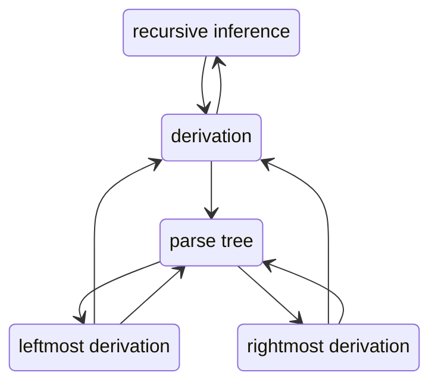

## Proof for L2's Last Theorem

### Theorem

> For CFG $G=(V,T,P,S)$, the following are equivalent:
>
> 1. The recursive inference procedure determines that terminal string $w$ is in the language of variable $A$.
> 2. $A\overset{*}{\Rightarrow}w$.
> 3. $A\overset{*}{\underset{lm}{\Rightarrow}}w$.
> 4. $A\overset{*}{\underset{rm}{\Rightarrow}}w$.
> 5. There is a parse tree with root $A$ and yield $w$.

<!-- more -->

### Comment

Actually this theorem is not accurate. For example, we can actually feel that if we reverse a derivation, we get a recursive inference procedure.

The textbook doesn't give a formal definition of recursive inference, and I think the reason why it doesn't show that is that recursive inference is merely the inverse of derivation. But I'm not pleased that the book discusses proof about recursive inference without giving a formal definition of it! And actually what the book does about this part is equivalent to this proposition:

**Proposition 1**

> Set $X=X_1X_2\cdots X_k\in(V\cup T)^*$, $w\in T^*$, if $X\overset{*}{\Rightarrow}w$, then $\exists w_1,w_2,\cdots,w_k$ that:
>
> - $w=w_1w_2\cdots w_k$.
> - For $i\in\{1,2,\ldots,k\}$, $X_i\begin{cases}=w_i,&X_i\in T,\\ \overset{*}{\Rightarrow} w_i,&X_i\in V,\end{cases}$

which is easy to prove by induction.

Also, actually a parse tree is in correspondence to a unique leftmost derivation (or to a rightmost derivation). This is an important proposition in the discussion of ambiguity in grammars, which will be proved in next section.

Our proof would be like:

Both-side arrows between two means bijection.

So, what's left is just derivation to a parse tree. Here's the proof:

### Derivation to parse tree

First, for convenience, we shall extend $w$ into any sentence in $(V\cup T)^*$.

Induction on steps of derivation $n$ to $w$ :

1. $n=1$, i.e., there are production $A\rightarrow w$. There are a parse tree that just looks like this.
2. Suppose there are a parse tree corresponding to every derivation of steps at most $n$. Consider the last step of a derivation to $w$ that has $n+1$ steps ($\alpha X\beta\Rightarrow \alpha\gamma\beta=w$). We know that there are a parse tree corresponding to $A\overset{*}{\Rightarrow} \alpha X\beta$ which yields $\alpha X\beta$. Consider extending the tree by adding letters of $\gamma$ to leaf node $X$. It's the same to prove by induction that the result is also a parse tree, and it yields $\alpha\gamma\beta$ that is exactly $w$.

By the way, in the process we can also prove that:

> Each step of derivation corresponds to an interior node (or root) in the parse tree. 
>
> The steps taken to derive an intermediate sentence $X$ equals to the length of shortest path from root to the children of the interior node the derivation corresponds to.

## Ambiguity

### Definition

>  A CFG $G=(V,T,P,S)$ is *ambiguous* if and only if $\exists w\in T^*$, there are two different parse trees that have root $S$ and yield $w$.

Unfortunately, given any CFG, telling whether it's ambiguous is undecidable. But we have a equivalent definition for ambiguity:

>  A CFG $G=(V,T,P,S)$ is *ambiguous* if and only if $\exists\:w\in T^*$, there are two different leftmost (or rightmost) derivations that show $w$ is in the language of $S$.

This was mentioned before, it's equivalent to proving that there are a bijection between the set of parse trees and the set of leftmost (rightmost) derivations. Now we prove it for leftmost derivation:

### Leftmost derivation & parse tree

We first prove that each parse tree gives a leftmost derivation.

#### Parse tree gives a leftmost derivation

We can't expand this to $(V\cup T)^*$ because there may be $w\in(V\cup T)^*$ that satisfies $S\overset{*}{\Rightarrow}w$ but there are no leftmost derivation from $S$ to $w$. So we need to change a little bit in our way of induction. Let's first prove a lemma:

##### Lemma 1

> Set $X=X_1X_2\cdots X_k\in(V\cup T)^*$, $w=w_1w_2\cdots w_k\in T^*$, 
>
> -  If $\forall i\in\{1,2,\ldots,k\}$, $X_i\overset{*}{\underset{lm}{\Rightarrow}}w_i$ or $X_i=w_i$, then $X\overset{*}{\underset{lm}{\Rightarrow}}w$.

***proof:***

Set $Y_i=w_1w_2\cdots w_iX_{i+1}X_{i+2}\cdots X_k$, and $Y_0=X$, $Y_k=w$, we can show that $\forall i\in\{1,2,\ldots,k\}$, $Y_{i-1}\underset{lm}{\Rightarrow}Y_i$. Thus by easy induction lemma 1 is proved. 

Q.E.D. lemma 1.

##### Proof

Then we can do induction on the height $h$ of the parse tree.

1. $h=1$, trivial;

2. From $h=n$ to $h=n+1$:

   Assume that the root $A$ directly connect $X_1,X_2,\ldots,X_k$, which means applying production $A\rightarrow X_1X_2\cdots X_k$. Proposition 1 and inductive basis tell us that there are corresponding $X_i\overset{*}{\underset{lm}{\Rightarrow}}w_i$. Lemma 1 provides a way to construct $X\overset{*}{\underset{lm}{\Rightarrow}}w$, together with $A\underset{lm}{\Rightarrow}X$, we know that there is a corresponding leftmost derivation.

Q.E.D. parse tree to leftmost derivation.

#### Injection

We have just proved that every parse tree gives a leftmost derivation. Actually the induction can be viewed as a recursive method constructing a corresponding leftmost derivation:

1. If $h=1$, trivial;

2. If $h>1$, then $A\underset{lm}{\Rightarrow}X=X_1X_2\cdots X_k\overset{*}{\underset{lm}{\Rightarrow}}w_1X_2\cdots X_k\overset{*}{\underset{lm}{\Rightarrow}}\cdots\overset{*}{\underset{lm}{\Rightarrow}}w_1w_2\cdots w_k=w$. Apart from the first step, all other steps are constructed by recursion.

We can now prove that different parse trees must give different leftmost derivation with this method. The detailed proof is simply induction similar to above.

Q.E.D. injection.

#### Surjection

Now we need to prove for surjection. The idea is the same, we now do induction on the number of steps in the derivation. The detailed proof is again similar.

Q.E.D. surjection.

### Inherent ambiguity

A CFL $L$ is said to be ***inherently ambiguous*** if all its grammars are ambiguous.

Whether a CFL is ambiguous or not is not determinable. 

However, usually we prefer unambiguous grammars, so we try to construct unambiguous grammar for given language. The course gave some examples of eliminating ambiguity in certain grammars.

#### Priority of operations

For CFG $G_{exp}$ given in last lecture note:

- $E\rightarrow EOE|(E)|v|d$.
- $O\rightarrow +|\times$.

For string $v+v\times d$, there are two different leftmost derivations:

- $E\Rightarrow EOE\overset{*}{\Rightarrow} v+E\Rightarrow v+EOE\overset{*}{\Rightarrow}v+v\times d$.
- $E\Rightarrow EOE\Rightarrow EOEOE\overset{*}{\Rightarrow}v+v\times d$.

If you draw the parse tree, you will find out that the first one does multiplication prior to addition while the other does addition prior to multiplication.

We can design a grammar to do multiplication first as in practice:

- $E\rightarrow E+E|T$.
- $T\rightarrow T\times T|(E)|v|d$.

#### Associativity of operations

Having priority of different operations is not enough, for example, $v+v+d$ has two different leftmost derivations:

- $E\Rightarrow E+E\Rightarrow E+E+E\overset{*}{\Rightarrow}v+v+d$.
- $E\Rightarrow E+E\Rightarrow v+E\Rightarrow v+E+E\overset{*}{\Rightarrow}v+v+d$.

We now introduce left-associativity:

- $E\rightarrow E+T|T$.
- $T\rightarrow T\times F|F$.
- $F\rightarrow (E)|v|d$.

This guarantees that we do left addition or multiplication first when there are consecutive additions or multiplications.

#### if and else

We can design a simple grammar for if-else sentence structure:

- $S\rightarrow \epsilon|iS|iSeS$.

But for $iie$, there are two different leftmost derivations:

- $S\Rightarrow iSeS\Rightarrow iiSeS\overset{*}{\Rightarrow}iie$.
- $S\Rightarrow iS\Rightarrow iiSeS\overset{*}{\Rightarrow}iie$.

This is called *dangling else ambiguity*. It can be solved by matching each $else$ with the nearest $if$, and considering $else$ from left to right.

- $S\rightarrow \epsilon|iS|iMeS$.
- $M\rightarrow \epsilon|iMeM$.